The scheduling features of Plex-Meta-Manager [PMM] depend on it running constantly so it can wake up at 3AM to do its thing.

The simplest way to do this is to just run `python plex-meta-manager.y` in a command window [Terminal on OS X or PowerShell on Windows].  That will sit and wait until 3AM, wake up and do its thing, then go back to waiting.

However: you need to keep that window open.  You can minimize it, but it always has to be there, and it won't survive a reboot.

Note: you can use things like `screen` or `tmux` to run PMM in the background, which would allow you to close the terminal connection and allow it to continue, but that won't survive a reboot of the machine, so is of limited utility.

That's probably not what you want.  Here are some alternatives.

Note: "do its thing" here refers to creating collections and whatever else you have PMM configured to do.  I'll be using that phrase throughout to distinguish between "running" PMM generally and PMM "running" metadata operations.

## Run it in Docker

This is probably the simplest and most robust if your platform can handle it.

When you run PMM in a Docker container, it will come back up after reboots and run in the background without an open window automatically.

There's a [Docker Walkthrough](https://github.com/meisnate12/Plex-Meta-Manager/wiki/Docker-Walkthrough) to get you started, but basically if you run:

```
docker run -d \
  --restart=unless-stopped \
  -e TZ=US/Pacific \
  -v /path/to/config:/config:rw \
  meisnate12/plex-meta-manager
```
It will run in the background forever until you stop it, waking up at 3AM every day to do its thing.

There are a variety of [parameters](Run-Commands-&-Environmental-Variables.md) available to customize the time and so on, but that's the minimal case.

Perhaps your system can't run Docker, though.

## Windows
<br />

### Task Scheduler

Windows Task Scheduler allows you to tell the computer to do things on a variety of schedules.

These examples are assuming you're running it locally, not in Docker.  You could replace the commands in the scripts below with a `docker run` if you wish.

PMM can run, broadly, run in two "modes".  You can tell it to do its thing right away, or it can wait until some time [default is 3AM] to wake up and do its thing.

Say you want PMM to run every day at 7 AM, do its thing, and exit.  Here's how to do that.

<details>
  <summary>Scheduled one-time run</summary>
  <br />

1. Create a script to run PMM.  You can do this in any text editor; I'm using notepad.

   I'm assuming you installed PMM using the [Local Walkthrough](https://github.com/meisnate12/Plex-Meta-Manager/wiki/Local-Walkthrough) and so have the virtual environment described there set up.

   ```batch
   cd C:\User\IEUser\Plex-Meta-Manager-1.15.1
   .\pmm-venv\Scripts\python .\plex_meta_manager.py --run
   ```

   Of course, that path should reflect your own environment.

   The script goes to the PMM directory, then runs the script with the `--run` flag which triggers an immediate processing.  It will do its thing and exit.

   Save this file in the PMM directory as `runner.cmd`.

2. Open Task Scheduler

   Type "task" into the search field of the start menu, and choose "Task Scheduler" [NOT "Task Manager"

   

3. Create a basic task

   Over on the right, click "Create Basic Task"

   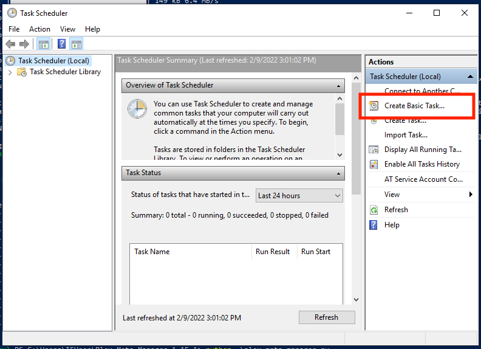

4. Give it a name [and a description if you wish], click "Next".

   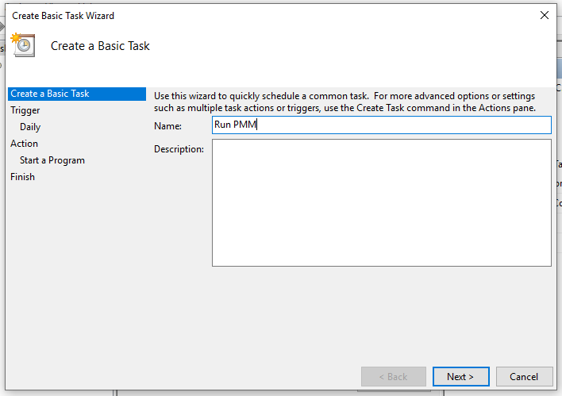

5. Choose when you want it to run [here we're choosing "daily" since we want it to run every day], click "Next"

   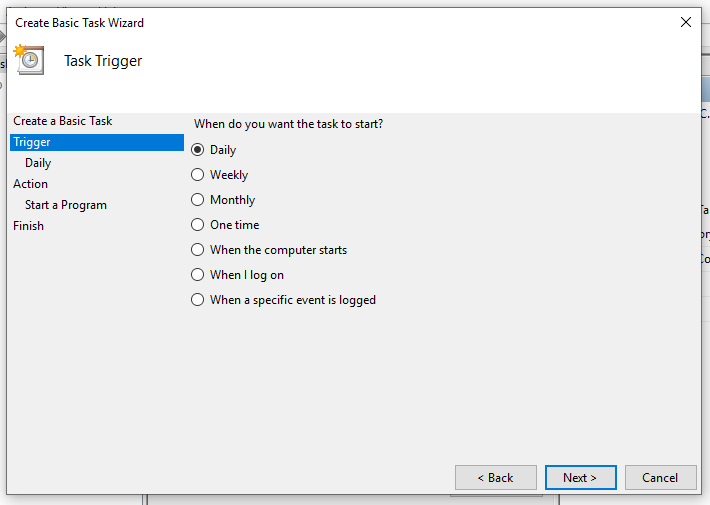

6. Specify start date and time, click "Next".

   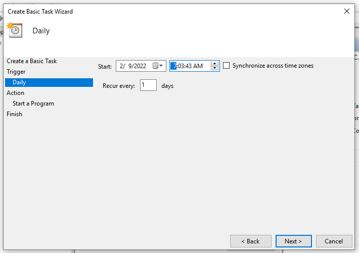

7. Choose the action to take, click "Next".

   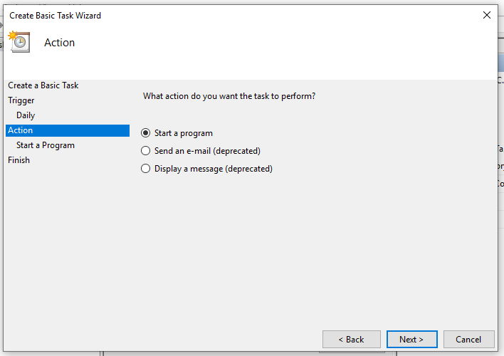

8. You'll be asked to find the thing] you want to run.  Navigate to the PMM directory and choose `runner.cmd`, which you created in step 1.

   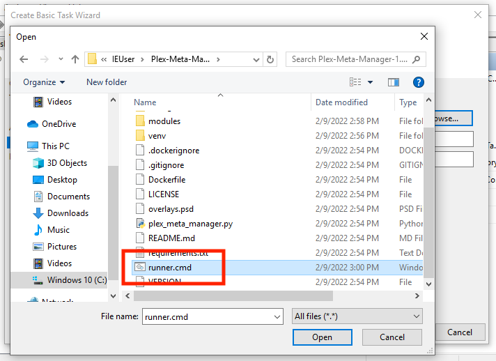

9. Copy the directory [everything up to but not including `runner.cmd` from the "Program/Script" field, and paste it into the "Start in" field.  This is `C:\User\IEUser\Plex-Meta-Manager-1.15.1` in the example below.

   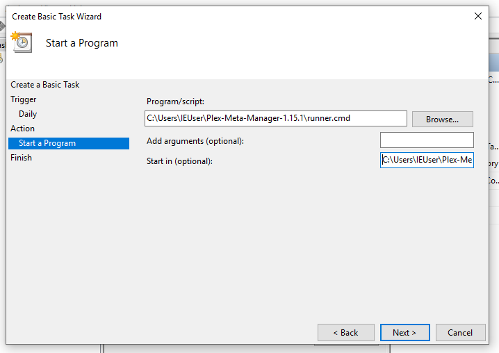

10. Check "Open the properties dialog" if you wish, then click "Finish".

   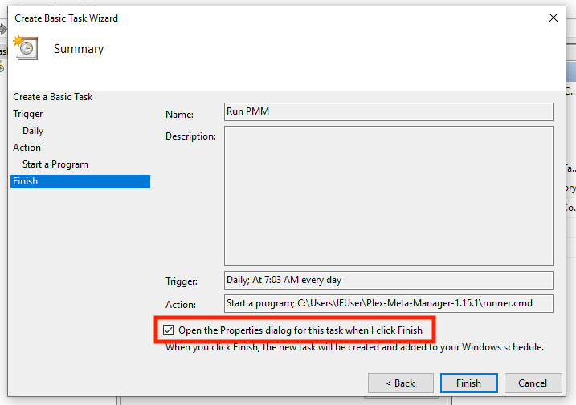

   The Properties dialog will show you details for your review.  You don't have to do anything with them.

11. Click "Task Schedule Library" on the left.  You can see your new task in the list.

   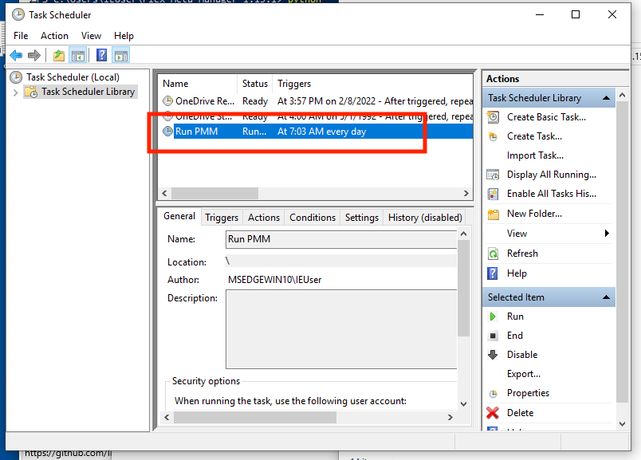

12. You're done.
</details><br />


Say you want PMM to start up with the machine, and use its internal schedule of waiting until 3AM to do its thing.  You want it to be running whenever this computer is running. Here's how to do that.

<details>
  <summary>Start PMM when the machine starts up</summary>
  <br />

1. Create a script to run PMM.  You can do this in any text editor; I'm using notepad.

   I'm assuming you installed PMM using the [Local Walkthrough](https://github.com/meisnate12/Plex-Meta-Manager/wiki/Local-Walkthrough) and so have the virtual environment described there set up.

   ```batch
   cd C:\User\IEUser\Plex-Meta-Manager-1.15.1
   .\pmm-venv\Scripts\python .\plex_meta_manager.py
   ```

   Of course, that path should reflect your own environment.

   The script goes to the PMM directory, then runs the script in the default mode.  It will wait until 3AM, do its thing, and go back to waiting until 3AM the next day.

   Save this file in the PMM directory as `waiter.cmd`.

2. Open Task Scheduler

   Type "task" into the search field of the start menu, and choose "Task Scheduler" [NOT "Task Manager"

   

3. Create a basic task

   Over on the right, click "Create Basic Task"

   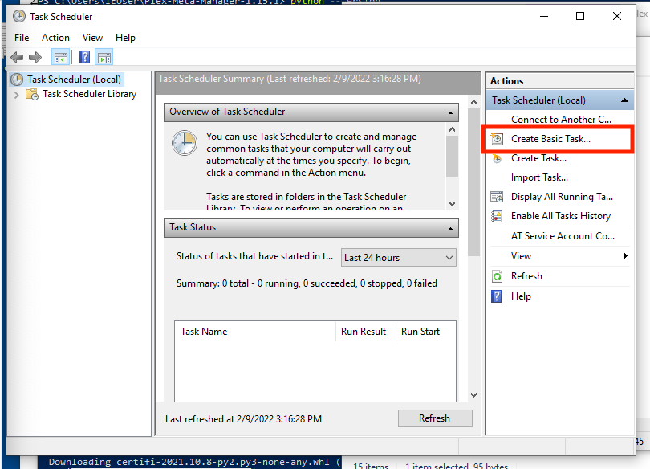

4. Give it a name [and a description if you wish], click "Next".

   

5. Choose when you want it to run [here we're choosing "When the computer starts" since we want it to run whenever this machine is up].

   

6. Choose the action to take, click "Next".

   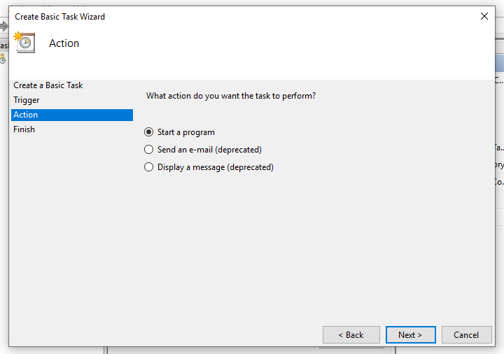
7. You'll be asked to find the thing] you want to run.  Navigate to the PMM directory and choose `waiter.cmd`, which you created in step 1.

   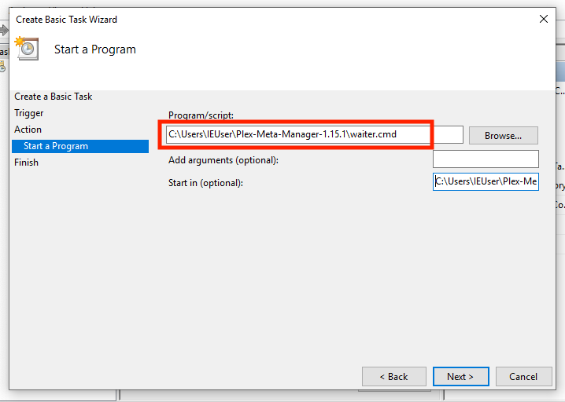

   Copy the directory [everything up to but not including `waiter.cmd` from the "Program/Script" field, and paste it into the "Start in" field.  This is `C:\User\IEUser\Plex-Meta-Manager-1.15.1` in the example below.

8. Click "Finish".

   

9.  You're done.

If you wanted to run the script with at startup, but specify a different time from 3AM, your `waiter.cmd` could look like this:


</details><br />


## Mac OS X
<br />
<details>
  <summary>Launchd Service</summary>
  <br />

1. Create launchd service:

   A couple examples; you'll want to edit the THINGS IN ALL CAPS to reflect your system.

   Keep PMM running constantly, let it wait to do its thing at 3AM:

   ```
   <?xml version="1.0" encoding="UTF-8"?>
   <!DOCTYPE plist PUBLIC "-//Apple//DTD PLIST 1.0//EN" "http://www.apple.com/DTDs/PropertyList-1.0.dtd">
   <plist version="1.0">
   <dict>
   	<key>Label</key>
   	<string>com.YOUR_USERNAME.plex-meta-manager</string>
   	<key>ProgramArguments</key>
   	<array>
   		<string>sh</string>
   		<string>-c</string>
   		<string>pmm-venv/bin/python plex-meta-manager.py --config /PATH/TO/PMM/config/config.yml</string>
   	</array>
   	<key>UserName</key>
   	<string>YOUR_USERNAME</string>
   	<key>WorkingDirectory</key>
   	<string>/PATH/TO/PMM</string>
   </dict>
   </plist>
   ```

   Run PMM every 6 hours, running it immediately and letting it quit:

   ```
   <?xml version="1.0" encoding="UTF-8"?>
   <!DOCTYPE plist PUBLIC "-//Apple//DTD PLIST 1.0//EN" "http://www.apple.com/DTDs/PropertyList-1.0.dtd">
   <plist version="1.0">
   <dict>
   	<key>Label</key>
   	<string>com.YOUR_USERNAME.plex-meta-manager</string>
   	<key>ProgramArguments</key>
   	<array>
   		<string>sh</string>
   		<string>-c</string>
   		<string>pmm-venv/bin/python plex-meta-manager.py --config /PATH/TO/PMM/config/config.yml --run</string>
   	</array>
   	<key>StartCalendarInterval</key>
   	<array>
   		<dict>
   			<key>Hour</key>
   			<integer>6</integer>
   		</dict>
   		<dict>
   			<key>Hour</key>
   			<integer>12</integer>
   		</dict>
   		<dict>
   			<key>Hour</key>
   			<integer>18</integer>
   		</dict>
   		<dict>
   			<key>Hour</key>
   			<integer>24</integer>
   		</dict>
   	</array>
   	<key>UserName</key>
   	<string>YOUR_USERNAME</string>
   	<key>WorkingDirectory</key>
   	<string>/PATH/TO/PMM</string>
   </dict>
   </plist>
   ```

   A useful tool to generate these plist files is [https://zerolaunched.herokuapp.com/](https://zerolaunched.herokuapp.com/)

   Save this file as `com.YOUR_USERNAME.plex-meta-manager.plist` in `~/Library/LaunchAgents`.

2. Load and start the agent 🚀

   Retrieve your user id with `id -u` in Terminal.  You'll need it for the commands in this step.

   Load the agent by executing the following commands:

   ```
   cd ~/Library/LaunchAgents/
   launchctl bootstrap gui/YOUR-USER-ID com.YOUR_USERNAME.plex-meta-manager.plist
   ```

   And then kick-start it with:

   ```
   launchctl kickstart -k gui/YOUR-USER-ID/com.YOUR_USERNAME.plex-meta-manager
   ```

   Note that this command uses the *label*, not the plist filename. The -k options means that the service will first be killed, if running.

   The agent should now be active and starting the program according to the schedule you set.
</details><br />


<details>
  <summary>cron</summary>
  <br />

See the cron section below.
</details><br />

## Linux
<br />
<details>
  <summary>cron</summary>
  <br />

1. Decide when you want to run Plex Meta Manager

   `cron` needs a specific syntax to express schedules.  A cron schedule is something like "Every Tuesday at 4" or "5 minutes past every other hour".

   You can generate the required line by checking boxes using something like [crontab-generator](https://crontab-generator.org/).

   The command you use in crontab will probably be the command you use to run it on the command line.

   A command you could use for this:

   ```
   /path/to/plex-meta-manager/pmm-venv/bin/python /path/to/plex-meta-manager/plex_meta_manager.py --config /path/to/plex-meta-manager/config/config.yml --run
   ```

   NOTE: This is assuming you created the `pmm-venv` virtual environment as described in the [Local Walkthrough](https://github.com/meisnate12/Plex-Meta-Manager/wiki/Local-Walkthrough)

2. Open the system crontab for editing:

   ```bash
   sudo crontab -e
   ```

3. Paste in the crontab line you got from `crontab-generator`, or type in one of your own.

4. Save and close the file.
</details><br />

<details>
  <summary>Run PMM as a systemctl service</summary>
  <br />

1. Create the service file:

   ```bash
   sudo nano /etc/systemd/system/plex-meta-manager.service
   ```

   Put the following into the file:
   ```
   # /etc/systemd/system/plex-meta-manager.service

   [Unit]
   Description=Plex Meta Manager
   After=network-online.target

   [Service]
   User=USER
   Group=GROUP
   Type=simple
   Environment=LC_ALL=C.UTF-8
   Environment=LANG=C.UTF-8
   WorkingDirectory=/path/to/plex-meta-manager
   ExecStart=/path/to/plex-meta-manager/pmm-venv/bin/python /path/to/plex-meta-manager/plex_meta_manager.py
   Restart=always
   RestartSec=10

   [Install]
   WantedBy=default.target
   ```

   Change `USER` and `GROUP` to reflect your user and group.

   Change `/path/to/plex-meta-manager` to reflect where you've installed Plex Meta Manager.

   NOTE: This is assuming you created the `pmm-venv` virtual environment as described in the [Local Walkthrough](https://github.com/meisnate12/Plex-Meta-Manager/wiki/Local-Walkthrough)

   Save and close the file.

2. Load and start the service

   ```shell
   sudo systemctl daemon-reload
   sudo systemctl start plex-meta-manager.service
   ```

3. You can check whether the service is running with:

   ```shell
   sudo systemctl status plex-meta-manager.service
   ```
</details><br />

