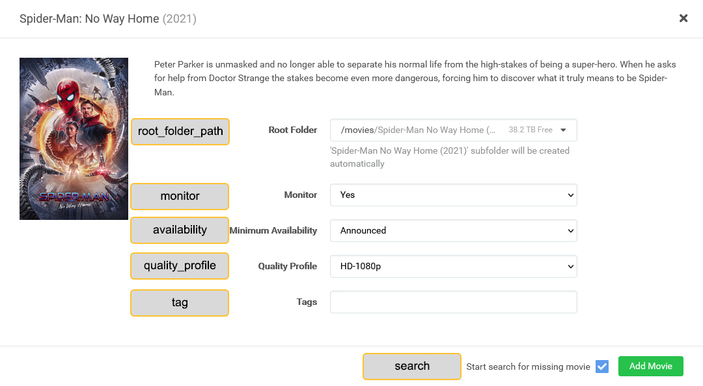

# Radarr Attributes

Configuring [Radarr](https://radarr.video/) is optional but will allow you to send movies to a Radarr instance when they're found missing while updating a library's collections. 

Radarr V2 may work, but it is not supported please upgrade to V3 if you can.

A `radarr` mapping can be either in the root of the config file as global mapping for all libraries or you can specify the `radarr` mapping individually per library.

Below is a `radarr` mapping example and the full set of attributes:
```yaml
radarr:
  url: http://192.168.1.12:32788
  token: ################################
  add: true
  root_folder_path: S:/Movies
  monitor: true
  availability: announced
  quality_profile: HD-1080p
  tag: pmm
  search: false
  radarr_path: /media
  plex_path: /share/CACHEDEV1_DATA/Multimedia
```

| Name             | Attribute          | Allowed Values                                                                                 |   Default   | Required |
|:-----------------|:-------------------|:-----------------------------------------------------------------------------------------------|:-----------:|:--------:|
| Radarr URL       | `url`              | Radarr URL (Including URL Base if set)<br>**Example:** http://192.168.1.12:32788               |     N/A     | &#9989;  |
| API Token        | `token`            | Radarr API Token                                                                               |     N/A     | &#9989;  |
| Add              | `add`              | Add missing movies found to Radarr<br>**boolean:** true or false                               |    false    | &#10060; |
| Add Existing     | `add_existing`     | Add movie existing in this collection to Radarr<br>**boolean:** true or false                  |    false    | &#10060; |
| Root Folder Path | `root_folder_path` | Radarr Root Folder Path To Use                                                                 |     N/A     | &#9989;  |
| Monitor          | `monitor`          | Monitor the added movie                                                                        |    true     | &#10060; |
| Availability     | `availability`     | Minimum Availability of the Movie<br>**Options:** `announced`, `cinemas`, `released`, `db`     | `announced` | &#9989;  |
| Quality Profile  | `quality_profile`  | Quality Profile To Use                                                                         |     N/A     | &#10060; |
| Tag              | `tag`              | Add this list or comma-separated string of tags to every movie added to Radarr                 |     ` `     | &#10060; |
| Search           | `search`           | Search when adding missing movies to Radarr<br>**boolean:** true or false                      |    false    | &#10060; |
| Plex Path        | `plex_path`        | When using `add_existing` or `radarr_add_all` Convert this part of the path to `radarr_path`   |     ` `     | &#10060; |
| Radarr Path      | `radarr_path`      | When using `add_existing` or `radarr_add_all` Convert the `plex_path` part of the path to this |     ` `     | &#10060; |

* The `token` can be found by going to `Radarr > Settings > General > Security > API Key`

* The `quality_profile` must be the exact name of the desired quality profile, including all spaces and capitalization.

* You can set most attributes per collection by using the [Radarr Details](../metadata/details/arr.md#radarr-details)


