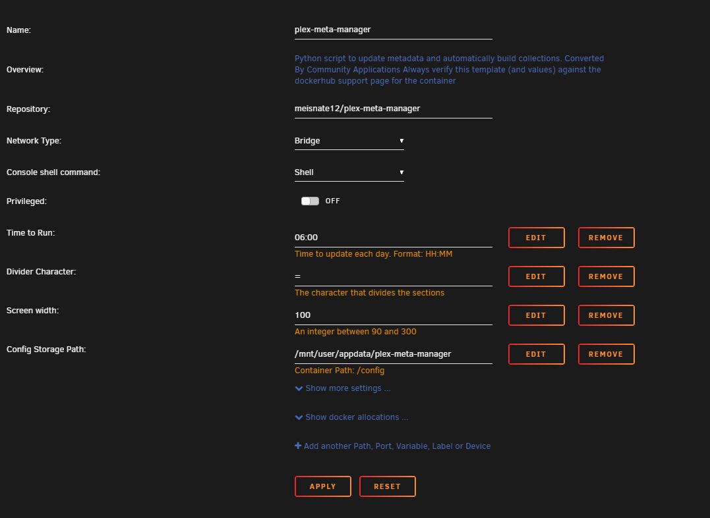

# unRAID Walkthrough

Thankfully, getting Plex Meta Manager working on unRAID is a fairly simple task. unRAID works mostly with docker containers, so the pre-built container available on docker hub works perfectly with a little configuration.
To install a container from docker hub, you will need community applications - a very popular plugin for unRAID servers. If you don't already have this installed, you can install it [here](https://forums.unraid.net/topic/38582-plug-in-community-applications/)

## Basic Installation

1. Head to the `Apps` tab of unRAID (Community Applications), and search `plex-meta-manager` in the upper right search box. No results will show, because plex-meta-manager has not been added to community applications yet. No need to fear, however, because the pre-built docker container is on docker hub. Click `Click Here To Get More Results From DockerHub`.

2. Click the download icon on the `plex meta manager` container by `meisnate12`.

3. Create your [Docker values](../home/environmental) using `Add another Path, Port, Variable, Label or Device`. Example config:

| Config Type | Name                | Key           | Value  | Container Path | Host Path                             | Access Mode | Description                                         |
|:------------|:--------------------|:--------------|:-------|:---------------|:--------------------------------------|:------------|:----------------------------------------------------|
| Variable    | Time to Run         | `PMM_TIME`    | `6:00` | N/A            | N/A                                   | N/A         | Time to update each day. Format: HH:MM              |
| Variable    | Divider Character   | `PMM_DIVIDER` | `=`    | N/A            | N/A                                   | N/A         | The character that divides the sections             |
| Variable    | Screen Width        | `PMM_WIDTH`   | `100`  | N/A            | N/A                                   | N/A         | An integer between 90 and 300                       |
| Path        | Config Storage Path | N/A           | N/A    | `/config`      | `/mnt/user/appdata/plex-meta-manager` | Read/Write  | Translation from docker container path to host path |

  * Full list of docker values can be found on the [Run Commands & Environmental Variables Page](../home/environmental).
  * If you wish to enable one-time [Run]([Run Commands & Environmental Variables Page](../environmental.md#run)), add `-r` to `Post Arguments` by enabling Advanced View in the top right of unRAID.
  * The Image below shows the above values in the unRAID WebUI.
  
    
4. Hit `Apply`, and allow unRAID to download the docker container.

5. Navigate to the `Docker` tab in unRAID, and stop the `plex-meta-manager` container if it has auto-started.

6. Create `config.yml` and `library.yml` files as-per the [documentation](../config/configuration) in the Host Path you set (/mnt/user/appdata/plex-meta-manager in the example)

7. Once finished, run the container. Voila! Logs are located in `yourhostpath/logs`.

## Advanced Installation (Authenticating Trakt or MyAnimeList)

Due to how unRAID handles docker containers, it can be a little confusing at first to enable Trakt, MyAnimeList, and other sources. At this time, these sources require you to follow through to a URL, and provide a code or link to Plex Meta Manager. unRAID doesn't have a built-in way to interact with the terminals of docker containers, so a workaround must be used:

1. Stop the Plex Meta Manager docker container if it's currently running.

2. Follow the instructions for either [Trakt](../config/trakt) or [MyAnimeList](../config/myanimelist), and add the relevant values to your `config.yml`

3. Edit the `Time to Run` variable to reflect a time that is NOT the current time. We don't want the script to be running right now. Set `Run` to `false` if you've chosen to add that variable. Then, start the container.

4. Click the Terminal button in the upper right corner of the unRAID WebUI (`>_`)

5. Run `docker exec -it plex-meta-manager /bin/bash`
   
   Note: this name is case-sensitive.  If this gives you an error like "Error: No such container: plex-meta-manager"; check the container config to see if you've named it something like "Plex-Meta-Manager",  If that's the case, change the name in the command to match your container.

6. Run `ls` to make sure you're in the same directory as `plex_meta_manager.py`. If you don't see the script, run `cd /`
  
7. Run `python plex_meta_manager.py -r`, and watch as the script comes to life.

8. You'll now notice, as per the [configuration documentation](../config/configuration) on these sources, the script will ask you to click a URL and return an input. Go ahead and do so in this terminal window.

9. Once finished, and the script succeeds in connecting to your source, press `Ctrl + C` to cancel the script - and close out of the terminal window. Go ahead and stop the docker container, restore your container settings to your original preferences (restore `Time to Run`), and start the container.
