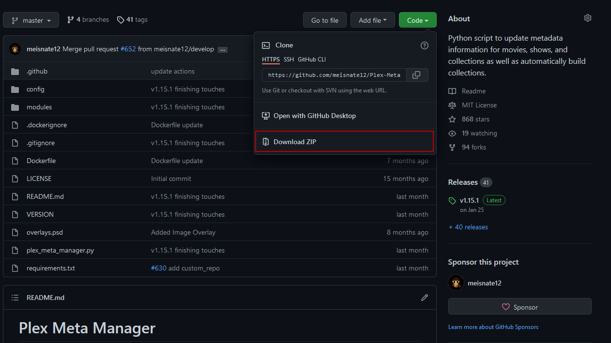

# Installation

## Local Installation

Testing has been done only on Python 3.7, 3.8, and 3.9 on Linux and Windows.

To start clone the repo or [download](https://github.com/meisnate12/Plex-Meta-Manager/archive/refs/heads/master.zip) and unzip the repo.



Then install dependencies by running:

```shell
pip install -r requirements.txt
```

If there are issues installing dependencies try:

```shell
pip install -r requirements.txt --ignore-installed
```

To run the script in an interactive terminal run:

```shell
python plex_meta_manager.py
```

## Docker Installation

A simple `Dockerfile` is available in this repo if you'd like to build it yourself. The official build is also available from dockerhub here: https://hub.docker.com/r/meisnate12/plex-meta-manager

```shell
docker run -it -v <PATH_TO_CONFIG>:/config:rw meisnate12/plex-meta-manager
```
* The `-it` allows you to interact with the script when needed. 
  * For example, it's required in order to go through the OAuth flow while connecting to Trakt or MyAnimeList.
* The `-v <PATH_TO_CONFIG>:/config:rw` mounts the location you choose as a persistent volume to store your files. 
  * Change `<PATH_TO_CONFIG>` to a folder where your config.yml and other files are. 
  * The docker image defaults to running the config named `config.yml` in your persistent volume.
  * Use quotes around the whole thing if your path has spaces i.e. `-v "<PATH_TO_CONFIG>:/config:rw"`

Example

```shell
docker run -it -v "X:\Media\Plex Meta Manager\config:/config:rw" meisnate12/plex-meta-manager
```

### Docker Compose Example

```yaml
version: "2.1"
services:
  plex-meta-manager:
    image: meisnate12/plex-meta-manager
    container_name: plex-meta-manager
    environment:
      - TZ=TIMEZONE #optional
    volumes:
      - /path/to/config:/config 
    restart: unless-stopped 
```