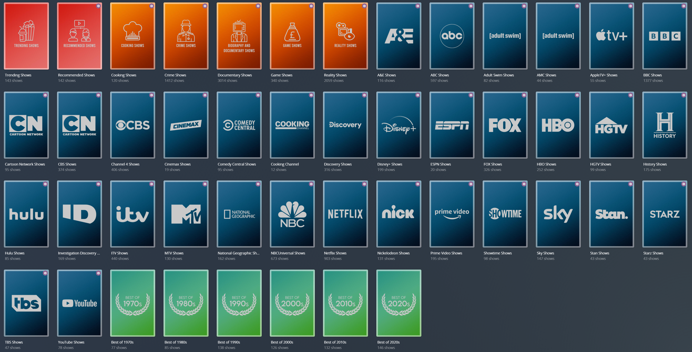

# Plex Meta Manager

The original concept for Plex Meta Manager is [Plex Auto Collections](https://github.com/mza921/Plex-Auto-Collections), but this is rewritten from the ground up to be able to include a scheduler, metadata edits, multiple libraries, and logging. Plex Meta Manager is a Python 3 script that can be continuously run using YAML configuration files to update on a schedule the metadata of the movies, shows, and collections in your libraries as well as automatically build collections based on various methods all detailed in the wiki. Some collection examples that the script can automatically build and update daily include Plex Based Searches like actor, genre, or studio collections or Collections based on TMDb, IMDb, Trakt, TVDb, AniDB, or MyAnimeList lists and various other services.

The script can update many metadata fields for movies, shows, collections, seasons, and episodes and can act as a backup if your plex DB goes down. If the time is put into the metadata configuration file you can have a way to recreate your library and all its metadata changes with the click of a button.

The script works with most Metadata agents including the New Plex Movie Agent, New Plex TV Agent, [Hama Anime Agent](https://github.com/ZeroQI/Hama.bundle), [MyAnimeList Anime Agent](https://github.com/Fribb/MyAnimeList.bundle), and [XBMC NFO Movie and TV Agents](https://github.com/gboudreau/XBMCnfoMoviesImporter.bundle).

## Getting Started

1. Install Plex Meta Manager either by installing Python3 and following the [Local Walkthrough](guides/local)
   or by installing Docker and following the [Docker Walkthrough](guides/docker) or the [unRAID Walkthrough](guides/unraid).
2. Once installed, you have to create a [Configuration File](../config/configuration) filled with all your values to connect to the various services.
3. After that you can start updating Metadata and building automatic Collections by creating a [Metadata File](../metadata/metadata) for each Library you want to interact with.
4. Explore the Wiki to see all the different Collection Builders that can be used to create collections.

## Wiki
The Wiki details evey available option you have with Plex Meta Manager its Table of Contents is below.

## Example Community Metadata Files
To see user submitted Metadata configuration files, and you to even add your own, go to the [Plex Meta Manager Configs](https://github.com/meisnate12/Plex-Meta-Manager-Configs).

## Support Discord
Before posting on GitHub about an enhancement, error, or configuration question please visit the [Plex Meta Manager Discord Server](https://discord.gg/NfH6mGFuAB) **it is without a doubt the best place to get support**.

## Feature Requests, Errors, and Configuration Questions
* If you have an idea for how to enhance Plex Meta Manager please open a new [Feature Request](https://github.com/meisnate12/Plex-Meta-Manager/issues/new?assignees=meisnate12&labels=status%3Anot-yet-viewed%2C+enhancement&template=feature_request.md&title=Feature+Request%3A+).
* If you're getting an Error please update to the latest develop branch and then open a [Bug Report](https://github.com/meisnate12/Plex-Meta-Manager/issues/new?assignees=meisnate12&labels=status%3Anot-yet-viewed%2C+bug&template=bug_report.md&title=Bug%3A+) if it's still happening.
* If you have a metadata configuration question post in the [Discussions](https://github.com/meisnate12/Plex-Meta-Manager/discussions).

## Development Build
* There is a [develop](https://github.com/meisnate12/Plex-Meta-Manager/tree/develop) branch which will have the most updated fixes and enhancements to the script.
* to access the Docker Image for the develop branch use the `develop` tag by adding `:develop` to the image name. i.e. `meisnate12/plex-meta-manager:develop`

## Contributing
* Pull Request are welcome but please submit them to the develop branch.
* If you wish to contribute to the Wiki please fork and send a pull request on the [Plex Meta Manager Wiki Repository](https://github.com/meisnate12/Plex-Meta-Manager-Wiki).

## IBRACORP Video Walkthrough

[IBRACORP](https://ibracorp.io/) made a video walkthough for installing Plex Meta Manager on unRAID. While you might not be using unRAID the video goes over many key accepts of Plex Meta Manager and can be a great place to start learning how to use the script.

<iframe width="560" height="315" src="https://www.youtube.com/embed/dF69MNoot3w" title="YouTube video player" frameborder="0" allow="accelerometer; autoplay; clipboard-write; encrypted-media; gyroscope; picture-in-picture" allowfullscreen></iframe>
